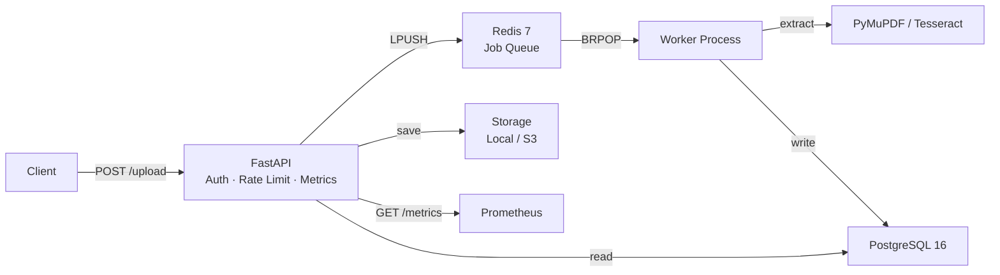

<h1 align="center">Document Processing Pipeline</h1>

<p align="center">
  <strong>Async microservice for extracting structured data from PDF documents at scale.</strong><br>
  Upload → Queue → Extract → Store → Export
</p>

<p align="center">
  
  
  
  
  
  <a href="https://github.com/RafiDr00/document-processing-pipeline/actions/workflows/ci.yml"></a>
  
</p>

<!-- 
▸ LIVE DEPLOYMENT
-->
<p align="center">
  <a href="https://document-processing-pipeline.onrender.com/docs"><strong>🚀 Live API Docs</strong></a> &nbsp;·&nbsp;
  <a href="https://document-processing-pipeline.onrender.com/health"><strong>Health</strong></a> &nbsp;·&nbsp;
  <a href="https://document-processing-pipeline.onrender.com/metrics"><strong>Metrics</strong></a>
</p>

---

### Quick Start

```bash
docker-compose up --build -d   # starts API + Worker + PostgreSQL + Redis
curl -X POST http://localhost:8000/api/v1/documents/upload -F "file=@invoice.pdf"
open http://localhost:8000/docs
```

### Key Endpoints

| Method | Path | Description |
|--------|------|-------------|
| `POST` | `/api/v1/documents/upload` | Upload & queue a PDF |
| `GET`  | `/api/v1/documents/{id}` | Retrieve document + extracted data |
| `GET`  | `/api/v1/documents` | List all documents |
| `POST` | `/api/v1/documents/{id}/export` | Generate Excel export |
| `GET`  | `/metrics` | Prometheus metrics |
| `GET`  | `/health` | Health check |

---

## Why This Project

Most PDF scraping scripts run as one-off notebooks. This project takes that pattern and re-implements it as a **production microservice** with:

- **Async everywhere** — FastAPI + asyncpg + redis.asyncio; zero blocking calls on the hot path
- **Background job queue** — Redis-backed worker pool (LPUSH / BRPOP) with automatic fallback to in-process BackgroundTasks
- **Storage abstraction** — Local filesystem or S3 via a single env var (`STORAGE_BACKEND`)
- **Observability** — Prometheus-compatible `/metrics` endpoint (custom lightweight counters, histograms, gauges — no heavy deps)
- **Security** — API-key auth (constant-time SHA-256 comparison), sliding-window rate limiting, filename sanitisation
- **Content deduplication** — SHA-256 hashing of every upload; hash is stored and returned
- **Multi-stage Docker build**, non-root container, health checks, GitHub Actions CI

---

## Architecture



> Full diagrams (sequence, ER, deployment): [`docs/architecture.md`](docs/architecture.md)
>
> **Try it now:** open `frontend/index.html` in your browser for a zero-install test UI (upload PDF → view extracted JSON → download Excel).

---

## Tech Stack

| Layer            | Technology                                         |
|------------------|----------------------------------------------------|
| **Web framework**| FastAPI 0.115 — async, OpenAPI docs, dependency injection |
| **Database**     | PostgreSQL 16 + SQLAlchemy 2.0 async (asyncpg), tuned connection pool |
| **Queue**        | Redis 7 — job queue, rate-limit counters           |
| **PDF native**   | PyMuPDF (fitz) — fast C-backed text extraction     |
| **PDF OCR**      | Tesseract + pdf2image + OpenCV                     |
| **Excel export** | pandas + openpyxl with auto-format & smart sorting |
| **Storage**      | Local FS or Amazon S3 (boto3), pluggable backend   |
| **Metrics**      | Custom Prometheus exposition (zero external deps)   |
| **Auth**         | API-key header + sliding-window rate limiter        |
| **Container**    | Multi-stage Docker, non-root, healthcheck           |
| **CI/CD**        | GitHub Actions — lint (ruff) → test → Docker build  |

---

## Project Structure

```
document-processing-pipeline/
├── app/
│   ├── main.py                  # Application entry + lifespan events
│   ├── worker.py                # Standalone Redis queue consumer
│   ├── api/
│   │   └── routes.py            # REST endpoints (upload, list, get, export, download)
│   ├── core/
│   │   ├── config.py            # Pydantic Settings (env-based)
│   │   ├── logging.py           # Structured JSON / text logging
│   │   ├── security.py          # API-key auth + rate limiting
│   │   ├── redis.py             # Async Redis connection singleton
│   │   └── metrics.py           # Prometheus counters, histograms, gauges
│   ├── db/
│   │   └── database.py          # SQLAlchemy async engine + session
│   ├── models/
│   │   └── document.py          # ORM models + Pydantic schemas
│   └── services/
│       ├── pdf_extractor.py     # Native + OCR extraction pipeline
│       ├── excel_exporter.py    # Excel generation with formatting
│       ├── storage.py           # Local / S3 storage abstraction
│       └── queue.py             # Redis job queue helpers
├── tests/
│   ├── conftest.py              # Fixtures (SQLite, test client, sample PDFs)
│   ├── test_api.py              # Endpoint tests (health, upload, retrieve, export)
│   └── test_extraction.py       # Unit tests (extractor, exporter)
├── docker/
│   └── Dockerfile               # Multi-stage production image
├── docs/
│   └── architecture.md          # Mermaid diagrams (system, sequence, ER)
├── .github/workflows/ci.yml     # Lint → Test (+ Redis) → Docker build
├── docker-compose.yml           # API + Worker + PostgreSQL + Redis
├── requirements.txt
├── requirements-test.txt
├── .env.example
├── pyproject.toml
└── LICENSE
```

---

## Quick Start

### Docker (recommended)

```bash
git clone https://github.com/RafiDr00/document-processing-pipeline.git
cd Bot-to-scrape-PDFs-and-populate-Excel

# Start all four services (API, Worker, PostgreSQL, Redis)
docker-compose up --build -d

# Tail logs
docker-compose logs -f api worker
```

API → `http://localhost:8000` &nbsp;|&nbsp; Docs → `http://localhost:8000/docs` &nbsp;|&nbsp; Metrics → `http://localhost:8000/metrics`

### Local Development

```bash
python -m venv .venv && .venv\Scripts\activate      # Windows
# python -m venv .venv && source .venv/bin/activate  # macOS / Linux

pip install -r requirements.txt -r requirements-test.txt

cp .env.example .env   # edit DATABASE_URL, REDIS_URL as needed

# Start API (auto-reload)
uvicorn app.main:app --reload

# Start worker (separate terminal)
python -m app.worker
```

> **System deps for OCR:** `tesseract-ocr` + `poppler-utils` (apt) or `tesseract` + `poppler` (brew).

---

## API Reference

All document endpoints are under `/api/v1/documents`. When `API_KEY` is set, include `X-API-Key: <key>` in every request.

### Upload a PDF

```bash
curl -X POST http://localhost:8000/api/v1/documents/upload \
  -H "X-API-Key: $API_KEY" \
  -F "file=@invoice.pdf"
```

```json
{
  "id": "a1b2c3d4-e5f6-7890-abcd-ef1234567890",
  "filename": "a1b2c3d4_invoice.pdf",
  "status": "pending",
  "content_hash": "sha256:e3b0c44298fc1c149afbf4c8996fb924...",
  "message": "Document queued for processing."
}
```

### Get Document + Extracted Records

```bash
curl http://localhost:8000/api/v1/documents/a1b2c3d4-... \
  -H "X-API-Key: $API_KEY"
```

```json
{
  "id": "a1b2c3d4-...",
  "original_filename": "invoice.pdf",
  "status": "completed",
  "extraction_method": "native",
  "processing_time_ms": 342,
  "page_count": 3,
  "records": [
    {
      "id": "...",
      "record_index": 0,
      "data": { "Name": "Acme Corp", "ID": "INV-2025-001", "Total": "1,250.00" },
      "confidence_score": null,
      "created_at": "2025-01-15T10:30:00Z"
    }
  ]
}
```

### List Documents

```bash
curl "http://localhost:8000/api/v1/documents?status=completed&limit=20" \
  -H "X-API-Key: $API_KEY"
```

### Export to Excel

```bash
curl -X POST http://localhost:8000/api/v1/documents/a1b2c3d4-.../export \
  -H "X-API-Key: $API_KEY"
```

### Download Excel

```bash
curl -OJ http://localhost:8000/api/v1/documents/a1b2c3d4-.../download \
  -H "X-API-Key: $API_KEY"
```

### Prometheus Metrics

```bash
curl http://localhost:8000/metrics
```

Returns counters, histograms, and gauges in Prometheus text exposition format.

---

## Configuration

Every setting is driven by environment variables (see [.env.example](.env.example)).

| Variable | Default | Purpose |
|---|---|---|
| `DATABASE_URL` | `postgresql+asyncpg://…` | Async PostgreSQL DSN |
| `REDIS_URL` | *(empty)* | Redis DSN; empty = in-memory fallback |
| `API_KEY` | *(empty)* | API key; empty = open access |
| `RATE_LIMIT_REQUESTS` | `120` | Requests per window per IP |
| `RATE_LIMIT_WINDOW_SECONDS` | `60` | Sliding window size |
| `STORAGE_BACKEND` | `local` | `local` or `s3` |
| `S3_BUCKET_NAME` / `S3_REGION` / `S3_ACCESS_KEY` / `S3_SECRET_KEY` | — | Required when `STORAGE_BACKEND=s3` |
| `DB_POOL_SIZE` | `5` | SQLAlchemy pool core size |
| `DB_MAX_OVERFLOW` | `10` | Extra connections under burst |
| `MAX_UPLOAD_SIZE_MB` | `50` | Upload size cap |
| `OCR_LANG` | `eng` | Tesseract language pack |
| `CHUNK_SIZE_PAGES` | `50` | Large-PDF page chunking |
| `LOG_FORMAT` | `json` | `json` or `text` |

---

## Database Schema

Tables are auto-created on startup. Key columns added in v2.0:

| Column | Table | Purpose |
|---|---|---|
| `storage_key` | documents | Abstract path (local or S3 key) |
| `content_hash` | documents | SHA-256 for deduplication |
| `extraction_method` | documents | `native` or `ocr` |
| `processing_time_ms` | documents | Wall-clock extraction time |
| `confidence_score` | extracted_records | Per-record quality signal |

Composite indexes: `(status, created_at)`, `(original_filename)`, `(document_id, record_index)`.

---

## Testing

```bash
# All tests (SQLite — no Postgres needed)
pytest

# With coverage
pytest --cov=app --cov-report=term-missing

# Specific module
pytest tests/test_api.py -v
```

CI runs against a real **Redis 7** service container, ensuring queue paths are exercised.

---

## Deployment

### Docker Compose (dev / staging)

```bash
docker-compose up -d --build          # API + Worker + Postgres + Redis
docker-compose logs -f worker         # Monitor job processing
docker-compose down -v                # Tear down with volumes
```

### Production Checklist

1. **Set `API_KEY`** to a strong random value
2. **Set `ENVIRONMENT=production`**, `DEBUG=false`, `LOG_FORMAT=json`
3. Tune `DB_POOL_SIZE` / `DB_MAX_OVERFLOW` for expected concurrency
4. Point `STORAGE_BACKEND=s3` and configure S3 credentials
5. Run multiple worker replicas: `docker-compose up --scale worker=3`
6. Put a reverse proxy (nginx / Caddy / ALB) in front of port 8000
7. Scrape `/metrics` with Prometheus + Grafana for dashboards

### Deploy on Render / Railway (fastest)

Both platforms support Docker deployments:

1. Connect your GitHub repository
2. Set the root Dockerfile path: `docker/Dockerfile`
3. Add environment variables: `DATABASE_URL`, `REDIS_URL`, `API_KEY`, `ENVIRONMENT=production`
4. Set health check path: `/health`
5. Deploy — the API is live at the provided URL

> Add a managed PostgreSQL and Redis add-on from the platform dashboard.

### Deploy on AWS (ECS + RDS + ElastiCache)

```bash
# Build & push
aws ecr get-login-password | docker login --username AWS --password-stdin <account>.dkr.ecr.<region>.amazonaws.com
docker build -t docpipeline -f docker/Dockerfile .
docker tag docpipeline:latest <account>.dkr.ecr.<region>.amazonaws.com/docpipeline:latest
docker push <account>.dkr.ecr.<region>.amazonaws.com/docpipeline:latest
```

- **API task** — ECS Fargate, CMD default (uvicorn 4 workers), port 8000, ALB health `/health`
- **Worker task** — same image, override CMD `["python", "-m", "app.worker"]`, no port mapping
- **RDS** — PostgreSQL 16, `DB_POOL_SIZE=20`, `DB_MAX_OVERFLOW=30`
- **ElastiCache** — Redis 7, single-node or cluster mode

> Full production guide with monitoring, backup, and security hardening: [`docs/deployment.md`](docs/deployment.md)

---

## CI/CD Pipeline

```
lint (ruff) → test (pytest + Redis service) → docker build (buildx + GHA cache)
```

All stages run on every push to `main` / `develop` and every PR targeting `main`.

---

## License

MIT — see [LICENSE](LICENSE).

---

<p align="center">
  <strong>Document Processing Pipeline v2.0</strong><br>
  FastAPI · PostgreSQL · Redis · Docker
</p>
