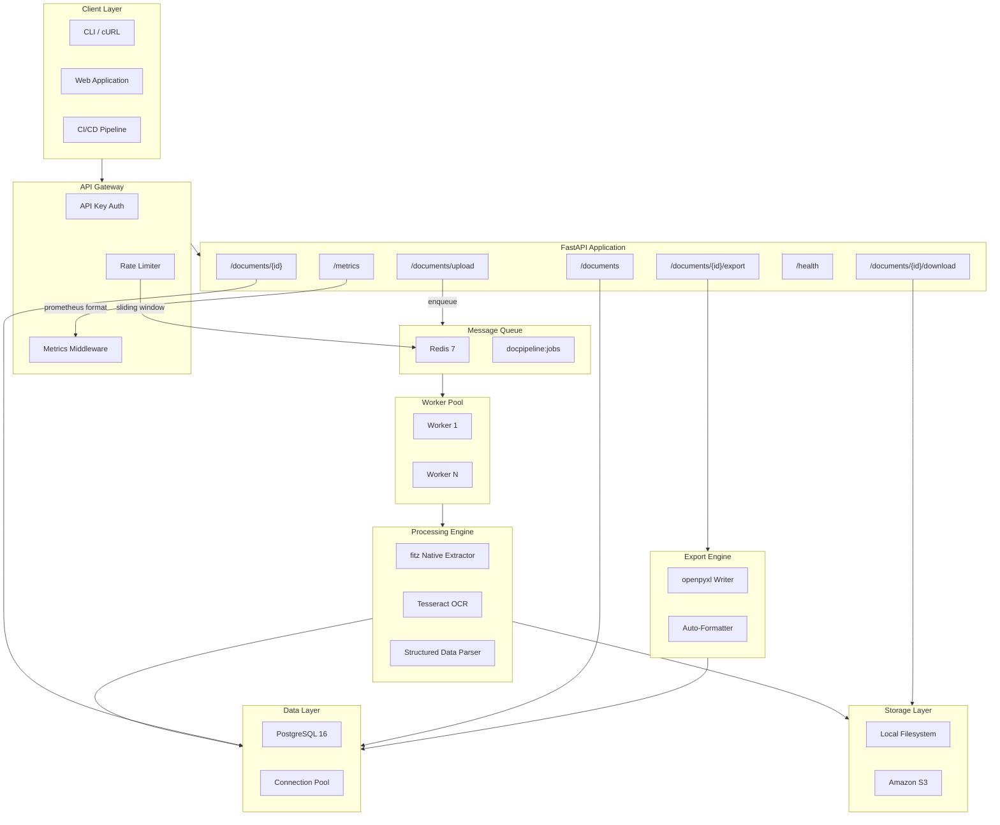
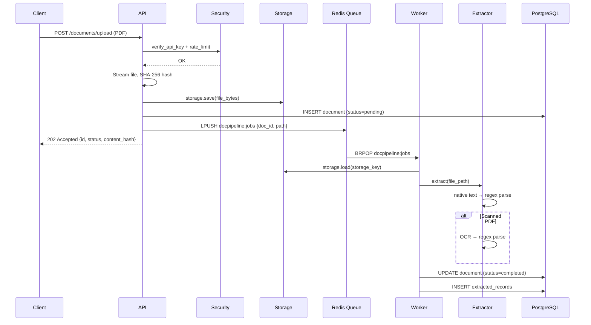
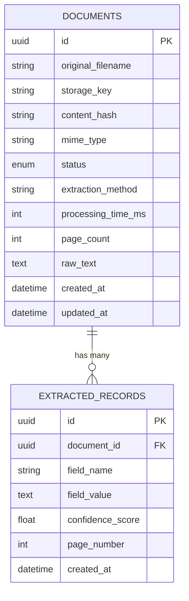
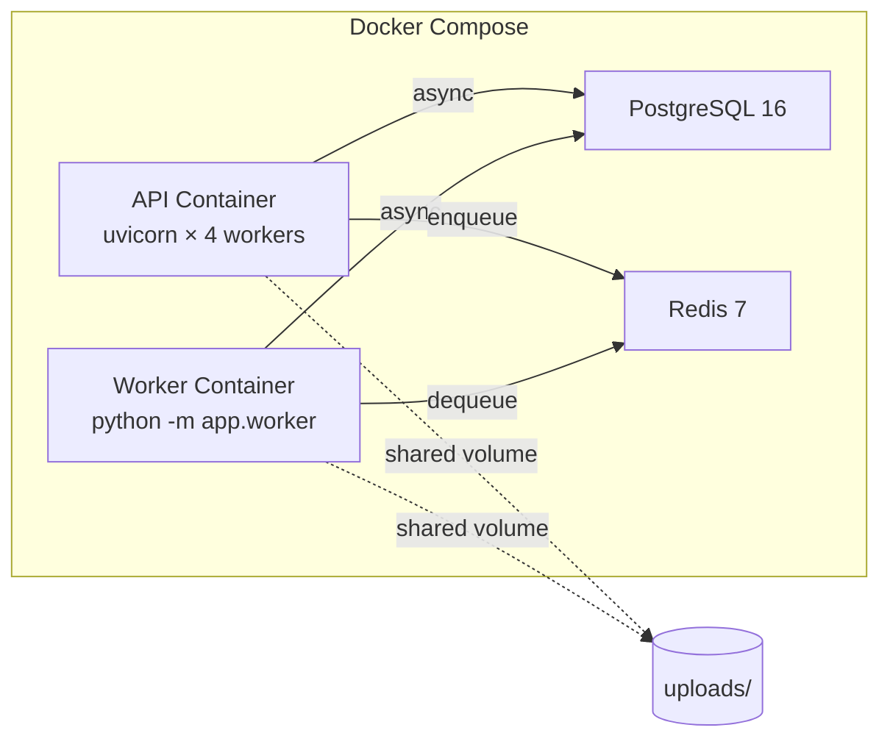

# Architecture Overview

## System Architecture

```mermaid
flowchart TB
    subgraph Client["Client Layer"]
        CLI["CLI / cURL"]
        WebApp["Web Application"]
        CI_CD["CI/CD Pipeline"]
    end

    subgraph Gateway["API Gateway"]
        Auth["API Key Auth"]
        RL["Rate Limiter"]
        Metrics["Metrics Middleware"]
    end

    subgraph API["FastAPI Application"]
        Upload["/documents/upload"]
        List["/documents"]
        Get["/documents/{id}"]
        Export["/documents/{id}/export"]
        Download["/documents/{id}/download"]
        Health["/health"]
        MetricsEP["/metrics"]
    end

    subgraph Queue["Message Queue"]
        Redis["Redis 7"]
        JobQueue["docpipeline:jobs"]
    end

    subgraph Workers["Worker Pool"]
        W1["Worker 1"]
        W2["Worker N"]
    end

    subgraph Processing["Processing Engine"]
        Native["fitz Native Extractor"]
        OCR["Tesseract OCR"]
        Parser["Structured Data Parser"]
    end

    subgraph Storage["Storage Layer"]
        Local["Local Filesystem"]
        S3["Amazon S3"]
    end

    subgraph Database["Data Layer"]
        PG["PostgreSQL 16"]
        Pool["Connection Pool"]
    end

    subgraph Export_["Export Engine"]
        Excel["openpyxl Writer"]
        Formatter["Auto-Formatter"]
    end

    Client --> Gateway
    Gateway --> API
    Upload --> |enqueue| Queue
    Queue --> Workers
    Workers --> Processing
    Processing --> Database
    Processing --> Storage
    Get --> Database
    List --> Database
    Export --> Export_
    Export_ --> Database
    Download --> Storage
    MetricsEP --> |prometheus format| Metrics
    RL --> |sliding window| Redis
```

## Request Flow — Document Upload

```mermaid
sequenceDiagram
    participant C as Client
    participant A as API
    participant S as Security
    participant St as Storage
    participant R as Redis Queue
    participant W as Worker
    participant E as Extractor
    participant DB as PostgreSQL

    C->>A: POST /documents/upload (PDF)
    A->>S: verify_api_key + rate_limit
    S-->>A: OK
    A->>A: Stream file, SHA-256 hash
    A->>St: storage.save(file_bytes)
    A->>DB: INSERT document (status=pending)
    A->>R: LPUSH docpipeline:jobs {doc_id, path}
    A-->>C: 202 Accepted {id, status, content_hash}

    R->>W: BRPOP docpipeline:jobs
    W->>St: storage.load(storage_key)
    W->>E: extract(file_path)
    E->>E: native text → regex parse
    alt Scanned PDF
        E->>E: OCR → regex parse
    end
    W->>DB: UPDATE document (status=completed)
    W->>DB: INSERT extracted_records
```

## Data Model

```mermaid
erDiagram
    DOCUMENTS {
        uuid id PK
        string original_filename
        string storage_key
        string content_hash
        string mime_type
        enum status
        string extraction_method
        int processing_time_ms
        int page_count
        text raw_text
        datetime created_at
        datetime updated_at
    }

    EXTRACTED_RECORDS {
        uuid id PK
        uuid document_id FK
        string field_name
        text field_value
        float confidence_score
        int page_number
        datetime created_at
    }

    DOCUMENTS ||--o{ EXTRACTED_RECORDS : "has many"
```

## Deployment Topology

```mermaid
graph LR
    subgraph Docker Compose
        API["API Container<br/>uvicorn × 4 workers"]
        Worker["Worker Container<br/>python -m app.worker"]
        PG["PostgreSQL 16"]
        Redis["Redis 7"]
    end

    API -->|async| PG
    Worker -->|async| PG
    API -->|enqueue| Redis
    Worker -->|dequeue| Redis
    API -.->|shared volume| Uploads[(uploads/)]
    Worker -.->|shared volume| Uploads
```
